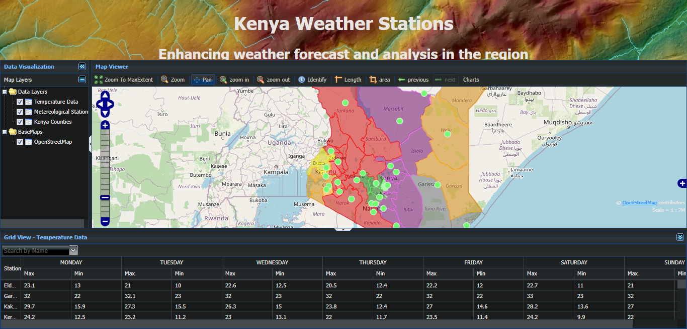

This is a web portal that manages data from several weather stations across the country, developed using GeoExt, ExtJS, and OpenLayers. A  sample application that demonstrates how to implement a web-mapping application with ExtJS, GeoExt and the OpenLayers API.
#Installation on local machine

Clone this repo on your local machine

Download the ExtJS library files from the Sencha Website, Version 4.2.1, http://cdn.sencha.com/ext/gpl/ext-4.2.1-gpl.zip .<br>
Uncompress and Rename the folder to extjs and move it to the weather-app directory.
Get the GeoExt library files from https://github.com/geoext/geoext2/releases/tag/v2.1.0 and unzip it. Rename to Geoext and move directory to weather-app directory.<br>
Download the OpenLayers library from http://openlayers.org/two/ , uncompress it and rename to OpenLayers. Move the directory to weather-app.<br>
Download the Silk Icons from http://famfamfam.com/lab/icons/silk/ and unzip to icons folder in the apps directory.<br>
Run the index.html file on browser


```
<!DOCTYPE html>
<html>
    <head>
        <title>Weather Map</title>
        <!-- Load the ExtJS stylesheet -->
        <link rel="stylesheet" type="text/css"href="http://cdn.sencha.com/ext/gpl/4.2.1/resources/css/ext-all.css">
        <!-- Load ExtJS from their CDN, local versions work also -->
        <script type="text/javascript"src="http://cdn.sencha.com/ext/gpl/4.2.1/ext-debug.js"></script>
        <!-- Load OpenLayers, custom builds may even be better -->
        <script src="http://openlayers.org/api/2.13.1/OpenLayers.js"></script>
    </head>
    <body></body>
</html>
```
Change the respective lines of code.

Edit the loaders.js file to feature the following:<br>
```
<script type="text/javascript">
Ext.Loader.setConfig({
    enabled: true,
    disableCaching: false,
    paths: {
        GeoExt: "path/to/src/GeoExt",
        Ext: "http://cdn.sencha.com/ext/gpl/5.1.0/src"
    }
});

</script>
```
Run the index.html on browser

#Screenshot



